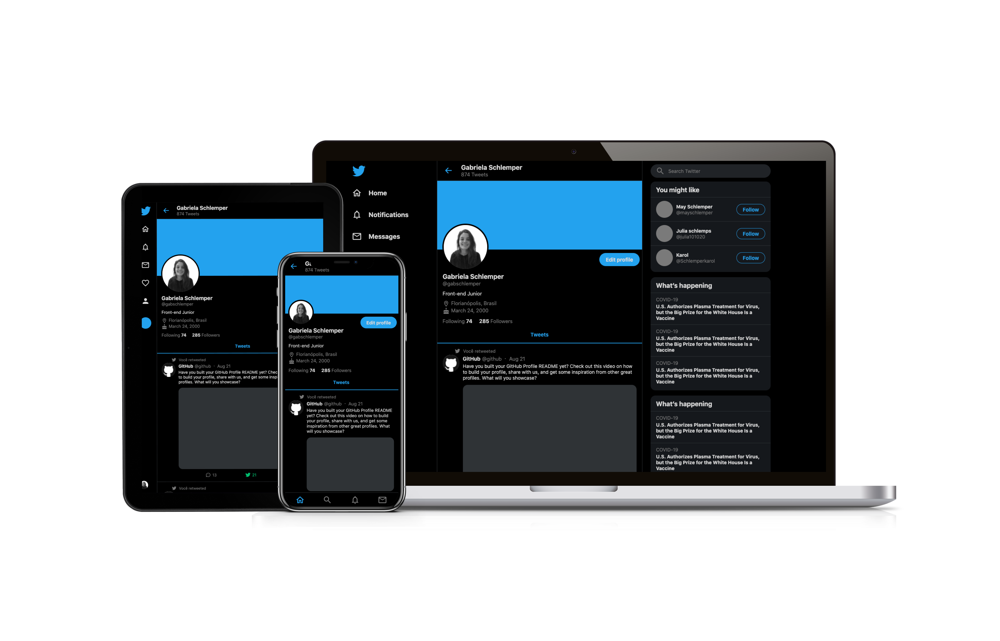

# Twitter Clone
This project is a Twitter clone using React and Styled Component focusing on responsive layout.

# Live [Demo](https://clone-twitter-react.netlify.app/)

# Installation 
1. Clone project: `git clone https://github.com/gabschlemper/clone-twitter-react.git`
2. To start: `yarn start`
3. To test: `yarn test`
4. To build: `yarn build`
